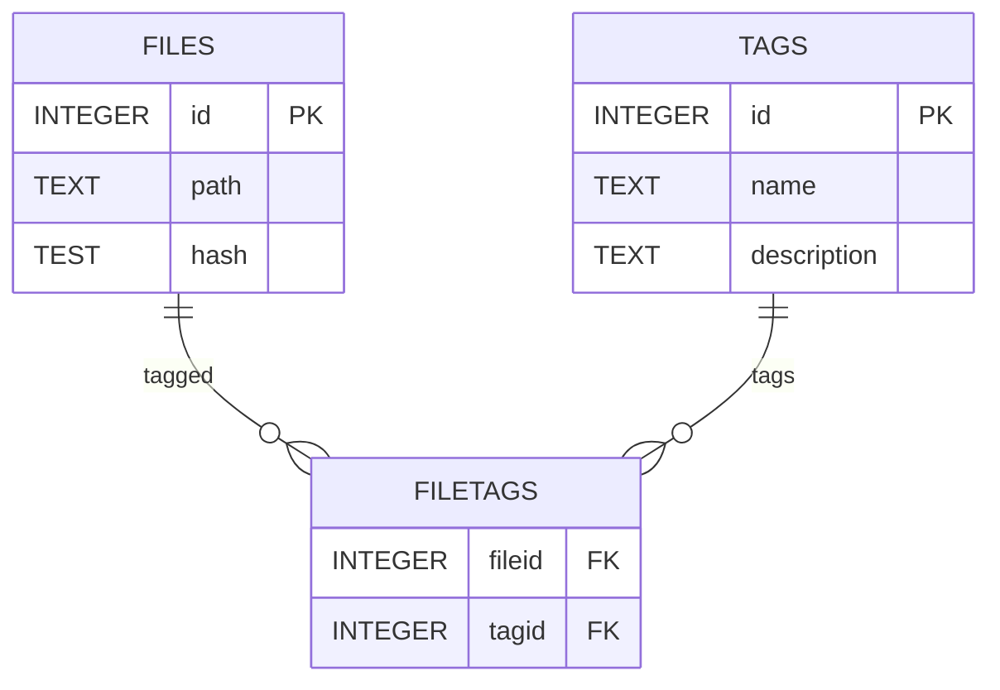

# Filesystem Tagger Database Documentation

## Entity Relationship

## Notes

* the file and tag IDs are named ROWIDs that can be used as a composite primary key with the tags
* `files.hash` to be used for re-scanning a file if it's been moved
